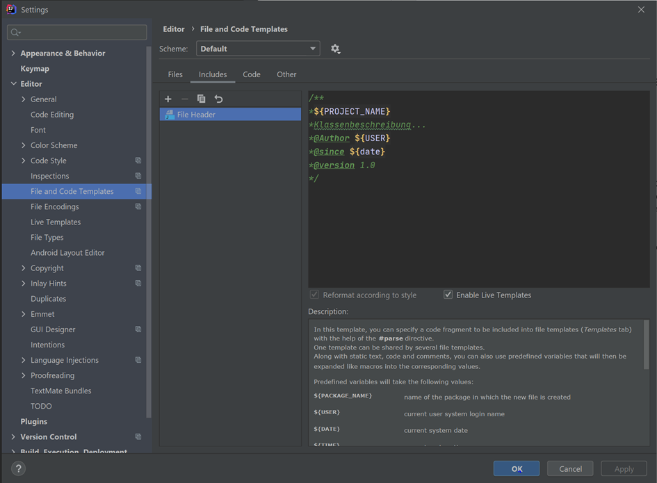

# Task 2.1: Setting up your IDE - IntelliJ

Now, that we know how to compile via command line window, let's switch to an integrated development environment,
which we simply call IDE.

In SDB/ProgB we use IntelliJ from Jetbrains.

You can install IntelliJ in different ways, for example

1. using the download option from the Jetbrains website: https://www.jetbrains.com/idea/download/?section=windows. Here,
   you find two different versions:
    1. IntelliJ IDEA Community Edition - completely free
    2. IntelliJ IDEA Ultimate Edition - free for educational use --> only if you registered via your TH email address
2. using Jetbrains' Toolbox that manages various Jetbrain products. This version is a good choice regarding managing
   updates automatically: https://www.jetbrains.com/de-de/toolbox-app/. So you first need to install the Toolbox and
   from within the toolbox select to install IntelliJ.

After your installation, you should visit this online tutorial to learn how to use the
IDE: https://www.jetbrains.com/help/idea/getting-started.html

### :point_up: Recommended links for the start:

> - Create your first Java
    application: https://www.jetbrains.com/help/idea/creating-and-running-your-first-java-application.html
> - Run your code: https://www.jetbrains.com/help/idea/running-applications.html
> - Debug Code: https://www.jetbrains.com/help/idea/debugging-code.html
> - Version control: https://www.jetbrains.com/help/idea/version-control-integration.html

### :keyboard: Exercise:

1. Create a new project
2. Find the automatically created Main class.
3. Compile and run the Main class.
4. Create a new package
5. Inside this package, create a new class that contains a main method. You can reuse the code from SumTemplate, for
   example.
6. Run this code.

## Some IntelliJ shortcuts

- Einfügen von Methoden und Konstruktoren
    - STRG + ALT + EINFG: Insert a new class
    - ALT + EINFG: insert setter/getter and constructors
    - psvm (type inside class): creates main method
    - souf (type inside class): System.out.printf();
    - sout (type inside class): System.out.println();
- Einstellungen:
    - STRG + Shift + ALT + S: project setting
    - STRG + ALT + S: intellij settings
- Create a header for JavaDoc: automatically inserts the header when creating a new class
    - Settings -> Editor -> File and Code Templates -> Includes
      
